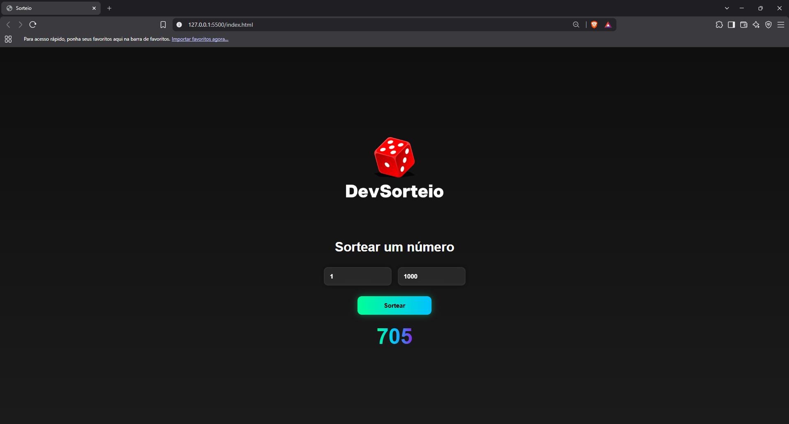

# 🎲 Sorteio de Números

Aplicação web desenvolvida com HTML, CSS e JavaScript para gerar números aleatórios dentro de um intervalo definido pelo usuário.

O projeto foi desenvolvido durante meus estudos de desenvolvimento Front-End, com foco na prática de JavaScript, manipulação do DOM, eventos e geração de valores aleatórios.

## 📸 Prévia



## 🚀 Demonstração

🔗 [Acessar o projeto](https://seu-link-da-vercel.vercel.app/)

## ⚙️ Funcionalidades

- Definição de um valor mínimo e máximo
- Geração de números aleatórios dentro do intervalo informado
- Exibição dinâmica do resultado na interface
- Interface responsiva para diferentes tamanhos de tela
- Efeitos visuais e interações com CSS

## 🛠️ Tecnologias

- HTML5
- CSS3
- JavaScript

## 📚 Conceitos praticados

Durante o desenvolvimento deste projeto, foram praticados conceitos fundamentais de desenvolvimento Front-End, como:

- Manipulação do DOM com `querySelector`
- Eventos com `onclick`
- Conversão de valores com `Number()`
- Geração de números aleatórios com `Math.random()`
- Arredondamento com `Math.floor()`
- Operadores matemáticos
- Atualização dinâmica do conteúdo da página
- Responsividade com Media Queries
- Organização de arquivos em um projeto web

## 💻 Como executar

### Pré-requisitos

Não é necessário instalar nenhuma dependência.

### Executando localmente

1. Clone o repositório:

```bash
git clone https://github.com/Felipe-Salgado12/sorteio-de-numeros.git
```
## 🎯 Objetivo

Este projeto foi desenvolvido com o objetivo de consolidar conhecimentos fundamentais de JavaScript e desenvolvimento Front-End, colocando em prática conceitos de lógica de programação, manipulação do DOM e interação com o usuário.

## 👨‍💻 Autor

**Felipe Salgado**

- GitHub: [Felipe-Salgado12](https://github.com/Felipe-Salgado12)
- LinkedIn: [Felipe Salgado](https://www.linkedin.com/in/felipesalgado12/)
